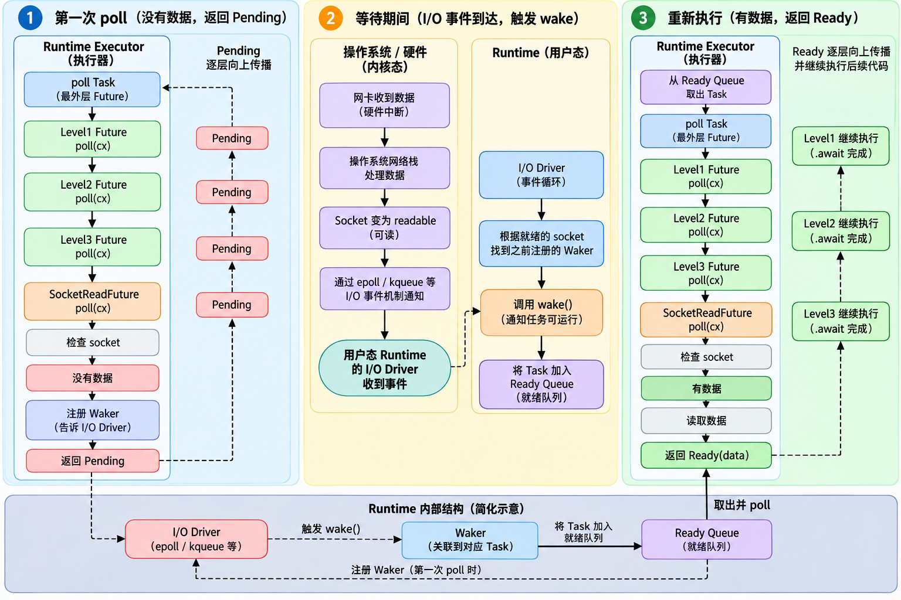

# Rust多线程编程

## 001 · 操作系统基本概念

在了解Rust异步编程之前，我们先了解一下操作系统的基本概念。

### 操作系统的特征

现代操作系统有四个特征：并发（concurrency）、共享（sharing）、虚拟（virtualization)、异步（Asynchronous）。其中**并发和共享**是两个个最基本的特征，二者互为存在条件。

由于CPU核数和线程数有限，因此多道批处理操作系统必须实现并发，也就是在一定的时间内允许多个程序并发执行，**宏观上**看是多道程序同时允许。有了并发之后，那么多个进程之间所占据的系统资源（内存空间、文件等）就需要共享。如果少了并发，那么共享会没有意义；如果不准共享，那么其他程序需要等待资源释放，并发也没有意义。所以二者是互为条件。

**虚拟技术**是指把一个物理上的实体转为逻辑上的抽象，让用户觉得操作系统能做出远超其配置能力的任务。比如：虚拟存储技术、虚拟I/O技术等。

今天的重点是**异步**，**异步是相对于同步而言的**。我们所常见的程序都是一步一步向下执行的，当程序出现费时操作时，那么后面的程序需要等待前面的程序执行完成，一直会独占CPU，对于CPU密集型任务，CPU等待对程序运行无关痛痒。然而程序中的代码并不总是需要得到前面程序得到的结果的，尤其是对于I/O密集型任务，CPU独占的开销极大影响了程序执行效率。因此异步概念就油然而生。异步允许处于等待计算结果的线程暂时放弃CPU资源，让其他准备好的线程优先使用CPU资源，直到该线程准备好，才将CPU资源释放给该线程。 在操作系统多道程序环境下，允许多个程序并发执行，但由于资源有限，进程的执行不是一贯到底的，而是走走停停，以**不可预知的速度向前推进**，这就是**进程的异步性**。

### 进程与线程

在操作系统中，进程拥有资源的最小独立单元，也就是说系统会给进程分配处理器+内存资源，不同的进程所占据的内存空间独立，不能被其他进程访问。而线程是程序执行的最小独立单元，其依赖进程所提供内存空间。一般而言，一个程序对应一个进程，一个进程能创建多个线程。彼此共享进程所占据的内存资源。

------

## 002 · rust并发编程

前文提到线程（thread）是一个程序中独立运行的一个部分。一个程序对应一个进程，进程允许创建多个线程。并发机制允许这些线程在一定时间内并发执行。然而由于程序的异步性，可能会出现互相死锁问题，也就是互相占据资源并且不肯释放。为了解决这些问题，很多其它语言（如 Java、C#）采用特殊的运行时（runtime）软件来协调资源，但这样无疑极大地降低了程序的执行效率。

Rust不依赖运行时环境，Rust 在语言本身就设计了包括所有权机制在内的手段来尽可能地把最常见的错误消灭在编译阶段。但是并不意味着rust能够将所有并发所造成的问题在公共范围内解决好，仍有可能出现错误。

### rust创建线程语法

Rust 中通过 std::thread::spawn 函数创建新线程：
```rust
use std::thread;

fn main() {
    thread::spawn(|| {		// spawn接受一个函数类型的变量，
        println!("子线程执行");
    });	// 返回一个JointHandle<()>类型的变量，我们成为线程的句柄，也就是线程标识

    println!("主线程执行");
}

// thread::spwan()
#[stable(feature = "rust1", since = "1.0.0")]
#[cfg_attr(miri, track_caller)] // even without panics, this helps for Miri backtraces
pub fn spawn<F, T>(f: F) -> JoinHandle<T>
where
    F: FnOnce() -> T,	// F 是一个可调用的闭包/函数，调用一次后消耗自身，返回 T
    F: Send + 'static,	// F 能安全地跨线程转移（Send），且不含非 'static 引用
    T: Send + 'static,	// 闭包返回的 T 也要能跨线程转移，且生命周期足够长
{
    Builder::new().spawn(f).expect("failed to spawn thread")
}

```

- `thread`：是Rust提供的一个处理并发的库，通常使用其中的`spawn`函数来实现并发

- `spawn`：返回了一个`JoinHandle<T>`类型的

- `JoinHandle<T>`：提供`join()`阻塞函数，这个会阻塞当前线程，直到当前线程返回（当前线程不一定能返回成功值）。

  ```rust
  use std::thread;
  
  fn main() {
      let handle = thread::spawn(|| {
          thread::sleep(std::time::Duration::from_secs(2));
          42
      });
      
      println!("before join");        // ① 立刻打印
      let result = handle.join().unwrap();  // ② 卡在这里约 2 秒	// unwarp检测子程序返回结果是否是错误
      println!("after join: {result}");     // ③ 2 秒后才打印
  }
  ```

在rust并发编程中，并发线程的创建常常伴随着`move`关键字，例如：

```rust
thread::spawn(move || {
    ...
});
```

上面这句话实际上是在修改闭包捕捉外部变量的方式，**由借用变为所有权转移**。举个简单的例子：

```rust
use std::thread;

fn main() {
    let name = String::from("Halley");

    let handle = thread::spawn(move || {	// 这里是使用 move 关键字将闭包借用 name 变为拥有。
        println!("{}", name);
    });

    handle.join().unwrap();
}
```

为什么需要`move`关键字呢？`F: Send + 'static`告诉我了我们答案。其主要原因是如果采用借用的话，当主线程关闭时，子线程的引用会出现悬垂问题，因此线程必须要用能够在线程执行过程中始终有效的引用。使用`move`将线程借用直接变为了线程拥有，从而规避引用悬垂。

此时就有好奇宝宝提出疑问了，如果`move`将外部变量的所有权变更到子线程中，那外部变量岂不是失效了，那么主线程就无法再使用。应对这种问题，rust设计了`Arc`计数器指针，这个指针允许在创建子线程时新增一个引用指向原来的外部数据。但是必须搭配`Arc::clone`来使用，因为`Arc`计数器指针没有实现`copy`（深度复制）。例如：

```rust
use std::thread;

fn main() {
    let name = Arc::new(String::from("Halley"));
    let name2 = Arc::clone(&name);	// 等价于 let name2 = name.clone();
    let handle = thread::spawn(move || {	// 这里是使用 move 关键字将闭包借用 name 变为拥有。
        println!("{}", name2);
    });
	print!("{}", name);		// 此时name并没有失效
    handle.join().unwrap();
}
```

上面只是简单介绍了一下线程之间怎么访问共享的资源问题，然而实际上的处理并发时的资源共享问题远比这复杂，详情请看第四节——线程之间通信问题。

------

## 003 · rust异步编程

rust中实现线程异步的方式主要是通过`async`来处理的，那么`async`到底做了哪些事情呢？

假设我们定义了一个函数

```rust
async fn get_data() -> String {
    String::from("hello")
}
```

当我们调用这个函数时，其返回的不是`String`类型的数据，这就奇怪了？函数命名写的返回值是`String`为什么调用时返回不是`String`呢？而是一个默认的`Future`类型呢？为了搞清楚，我需要直到编译器将`async`标记的函数做了什么样的转换。

实际上在编译时，编译器将`async fn get_data() -> String`转为了`fn get_data() -> impl Future<Output = String>`进行处理。这里就真相大白了，是因为编译器进行类型转换。

那么问题又来了，`Future`有什么用呢？在rust中，`Future`代表一个需要异步完成的任务，不是线程。而管理这些任务的是`Runtime`，但标准库没有直接提供完整的通用异步`Runtime`，所以通常要与`Tokio`搭配使用。这个`Runtime`可以理解为一个异步任务调度器。负责让哪些任务开始执行，哪些任务需要被阻塞。

那么这些异步任务通过什么进行阻塞的呢？**靠`await()`函数**。这个函数的作用主要是"当前`Future`主动告诉`Runtime`，我的数据还没准备好，我先让出执行权，等我数据准备好了再唤醒我"。

所以完整的逻辑链条是：

`Runtime`接收到了请求之后，会对顶层的`Task`进行`poll()`调用，然后底层`Future`状态机通过链式调用`poll()`直到最后一层`Future`，最后一层`Future`会检测阻塞操作是否已经完成，如：I/O请求、网络请求、`channel`通信等操作。如果没有完成，最后一层`Future`会注册`Waker::wake()`（当时间完成后触发），然后递归返回`Pending`状态，一直到`Runtime`接受到顶层`Future`的`Pending`信息。随后`Runtime`会将`Task` 暂时移出“正在执行”的状态。而不是一直循环。当操作完成之后，底层异步I/O系统找到`Task`对应的`Waker`执行`wake()`函数来通知`Runtime` `Task`任务可以继续了，于是`Runtime`又先调用顶层`Poll`，然后顶层`Future`状态机继续链式调用`Poll`，发现最后一层`Poll`成功返回，程序就加载断点继续执行。



举个使用`Tokio`实现线程异步通信的例子。

```rust
use tokio::sync::mpsc;
use tokio::time::{Duration, sleep};

async fn task_a(tx: mpsc::Sender<String>) {
    println!("A 开始生产数据");
    let data = task_a_send().await;
    println!("A 生产数据完成，开始发送");
    tx.send(data).await.unwrap();
    println!("A 发送完成");
}

async fn task_a_send() -> String {
    sleep(Duration::from_secs(3)).await;
    String::from("Hello from task_a_send")
}

async fn task_b(mut rx: mpsc::Receiver<String>) {
    println!("B 开始接收数据");
    // recv 返回 Option<String>：Some 表示收到数据，None 表示发送端全部关闭
    // 这里用 match 而非 unwrap，避免发送端提前关闭导致 panic
    match rx.recv().await {
        Some(data) => {
            println!("B 接收数据完成");
            println!("B 打印数据：{}", data);
        }
        None => {
            println!("B 没有收到数据，发送端已关闭");
        }
    }
}
#[tokio::main]
async fn main() {
    let (tx, rx) = mpsc::channel::<String>(1);
    let h1 = tokio::spawn(task_a(tx));
    let h2 = tokio::spawn(task_b(rx));
    let (_, _) = tokio::join!(h1, h2);	// tokio::join!能接受JoinHandle<T>的原因是因为其实现了Future Trait
    println!("main 完成");
}

```

------

## 004 · 线程之间的通信

线程之间通行问题主要有两种方式：

- **共享内存+同步原语：**通过线程共享或者互斥访问进程所占的内存资源来实现互相通行。
- **消息传递(channel)**：

### 共享内存+同步原语

资源共享是程序并发执行时绕不过去的问题。有些资源允许共享访问，多个线程同时访问；有些线程只允许互斥访问。同时每个线程对资源的访问方式又不一致，有的线程只读取资源不修改，有的线程不仅读取资源还需要对资源进行修改。因此程序并发执行时，必须处理好资源共享问题。

并发的线程访问资源主要有两种方式：共享访问与互斥访问。前者主要是多个线程读取数据，不对数据进行修改，因此可以共享访问。后者主要是有线程需要写入数据，为了保证其他线程能够第一时间拿到准确的数据，因此需要对数据进行上锁，保证同一时间内只允许一个线程访问。

rust语言的所有权机制很好解决了普通资源变量的共享问题，不会造成引用悬垂问题，然而在处理多线程中的资源共享中，所有权发生的唯一性必然导致只允许一个线程拥有，因此rust提出了一系列的智能指针来处理这类问题。具体的智能指针的用法请看[rust智能指针详解](2026-09-27-rust-reference.md)

1. **共享访问`Arc<T>`**：`Arc`指针是用于多线程之间共享所有权的计数器指针。每当一个线程创建并使用该资源时，该指针的计数器都会`+1`，通过`clone`函数自动计数。基本用法如下：

   ```rust
   use std::sync::Arc;
   use std::thread;
   
   fn main() {
       let message = Arc::new(String::from("hello"));
       let worker_message = Arc::clone(&message);	// clone 引用给新线程，原message引用依然能够使用
       let worker = thread::spawn(move || {
           assert_eq!(worker_message.as_str(), "hello");
       });
       worker.join().unwrap();
       assert_eq!(message.as_str(), "hello");
   }
   ```

2. **互斥访问`Mutex<T>`**：`Mutex<T>`指针用于处理多线程共享写入数据并保持同步时的指针。常常与`Arc<T>`组合使用`Arc<Mutex<T>>`：`Arc` 管所有权，`Mutex` 管同步。基本用法如下：

   ```rust
   use std::sync::{Arc, Mutex};
   use std::thread;
   
   fn main() {
       let counter = Arc::new(Mutex::new(0));	// 申明counter的资源类型是i32，上了一道锁并给其他线程通行证。
       let mut workers = Vec::new();
       for _ in 0..4 {
           let counter = Arc::clone(&counter);		// 复制一份引用
           workers.push(thread::spawn(move || {
               let mut value = counter.lock().unwrap();	// 上锁并取出里面资源
               *value += 1;	// 原子处理
           }));	// 离开作用域自动解锁
       }
       for worker in workers {
           worker.join().unwrap();		// 只有每个线程都返回结果，程序向后执行
       }
       assert_eq!(*counter.lock().unwrap(), 4);
   }
   ```

   **互斥访问因为会对资源进行上锁，因此对于独占资源的线程来说，其执行出现阻塞，那么会导致其他线程也处于阻塞状态。因此在写代码是，需要额外注意线程是否能够及时释放锁。**

### 消息传递机制

rust中的线程通信除了共享内存机制，同时也支持消息传递机制。Rust 标准库主要通过 `std::sync::mpsc` 提供线程间消息传递。`mpsc` 的全称是：**Multiple Producer, Single Consumer：多生产者，单消费者。**由此可见默认是**单工通信**

这种方式与共享内存方式有所区别，共享内存是两个线程同时对一个资源进行读写，需要保证数据同步问题。而消息传递机制是一个线程将数据直接发送给另一个线程，这个承接数据传输的就是通道（channel）。举个最简单的例子说明一下：

```rust
use std::sync::mpsc;
use std::thread;

fn main() {
    let (tx, rx) = mpsc::channel();	// 创建 Channel
    thread::spawn(move || {		// 创建子线程
        let message = String::from("Hello from child thread");	

        tx.send(message).unwrap();	// 子线程发送数据
    });
    let received = rx.recv().unwrap();    // 主线程接收消息
    println!("收到消息：{}", received);
}
```

上述代码首先通过`mpsc`中的`channel`函数创建了一个通道，然后创建子线程将发送数据一端给了子线程，主线程负责接受数据。

- `mpsc::channel()`：返回一个元组`(Sender<T>, Receiver<T>)`，一端发送，一段接受。
- `tx.send()`：负责发送数据，**消息会发生所有权转换**。发送端发送数据之后就失去了对原本数据的所有权，接受端接收到了数据就拥有了数据的所有权。
- `rx.recv()`：负责接受数据，**可能会阻塞当前线程**。当`channel`中没有数据时候会导致线程发生阻塞。

如果想让`channel`持续连接，并且接收端没有就接受到数据也不会阻塞，那么就可以使用`rx.try_recv()`函数，其用法如下：

```rust
match rx.try_recv() {	// 匹配数据
    Ok(message) => {
        println!("收到：{}", message);
    }
    Err(_) => {		
        println!("暂时没有消息");
    }
}
```

rust中`mpsc`是“多生产者、单消费者”模式，因此支持多个线程对同一个线程发送数据。实现方式通过`clone`来复制多个发送端口：

```rust
use std::sync::mpsc;
use std::thread;

fn main() {
    let (tx, rx) = mpsc::channel();
    for i in 0..3 {
        let tx_clone = tx.clone();
        thread::spawn(move || {
            let message = format!("来自线程 {}", i);
            tx_clone.send(message).unwrap();
        });
    }
    drop(tx);	// 销毁发送端 channel，避免后续线程持续监听
    for message in rx {	// 重复监听rx中的数据，直到所有 Sender 都被销毁之后。
        println!("收到：{}", message);
    }
}
```

Channel 可以传递各种满足线程安全要求的数据，不仅是字符串类消息，任何拥有所有权的数据。

从`mpsc`定义的名字就可以看出来，`channel`是一个单工通行，那么如果让两个线程中能够半双工通信、全双工通信呢？在rust中的做法是建立两个`channel`，两个线程均放一个发送端，一个接收端。这样就能实现一个双工通信。如果要实现半双工通信，那么就只需要两个channel使用同一个`message`。

实际程序经常不是传String，而是定义“消息协议”，比如一个主线程，一个`woker`线程。

```rust
use std::sync::mpsc;
use std::thread;

enum Command {
    Calculate(i32),
    Stop,
}

enum Response {
    Result(i32),
    Stopped,
}

fn main() {
    let (command_tx, command_rx) = mpsc::channel::<Command>();
    let (response_tx, response_rx) = mpsc::channel::<Response>();

    let worker = thread::spawn(move || {
        loop {	// 持续监听
            match command_rx.recv().unwrap() {	// 检查消息协议，是否需要停止
                Command::Calculate(x) => {	// 是消息则接受，并对操作进行处理，返回数据
                    response_tx
                        .send(Response::Result(x * x))
                        .unwrap();
                }

                Command::Stop => {	// 检测到停止信号，则返回停止信号，终止线程
                    response_tx
                        .send(Response::Stopped)
                        .unwrap();

                    break;
                }
            }
        }
    });

    command_tx.send(Command::Calculate(10)).unwrap();	// 发送信息

    match response_rx.recv().unwrap() {	// 匹配返回结果，返回正确则打印
        Response::Result(value) => {
            println!("计算结果：{}", value);
        }
        Response::Stopped => {}
    }

    command_tx.send(Command::Stop).unwrap();	// 发送终止信号

    worker.join().unwrap();		// 阻塞当前线程，直到线程结束。
}
```

> [!CAUTION]
>
> 双工通行需要注意的是，`resc()`会阻塞线程，所以双工通行会导致死锁问题，也就是谁先发送数据，谁先结束通信，这就需要通信协议设计。实际操作中必须要有一方明确提出终端`channel`信号，否则线程会一直空占CPU导致资源浪费。

刚才讲述一下无限缓冲区的线程通行，如果是固定缓冲区的线程通信会发生什么情况呢？rust中采用`mpsc::sync_channel()`来建立固定缓冲区的通道。我们直到，rust支持“多生产者和单消费者”模式的消息传递机制。在无限缓冲区中，生产者可以疯狂写数据，并且不用管缓冲区上限。但是在固定缓冲区内，消费者的读取速度不如生产者，就会导致缓冲区内的数据一直增加，从而到达上限，消费者就无法一直写入数据。此时消费者线程就会出现阻塞状态，那么生产者写入数据的速度与消费者消费的数据一致。

```rust
use std::sync::mpsc;
use std::thread;
use std::time::Duration;

fn main() {
    let (tx, rx) = mpsc::sync_channel(2);

    let producer = thread::spawn(move || {
        for i in 0..5 {
            println!("准备发送 {}", i);

            tx.send(i).unwrap();	// 消息队列满，阻塞发送端

            println!("发送完成 {}", i);
        }
    });

    let consumer = thread::spawn(move || {
        for value in rx {
            thread::sleep(Duration::from_secs(2));

            println!("消费 {}", value);
        }
    });

    producer.join().unwrap();
    consumer.join().unwrap();
}
```

rust中支持`mpsc::sync_channel(0)`一条消息都不缓存。也就是“手递手”方式。

综上，`mpsc::sync_channel()`这种固定大小的消息队列方式，那边阻塞取决于生产者和消费者的速度，哪边快，阻塞哪一边。

实际开发汇总，如果生产者速度可控，可以是用`channel`；反之，就需要使用`sync::channel`来设置一个安全上限，避免消息队列占据大量的内存空间。  
